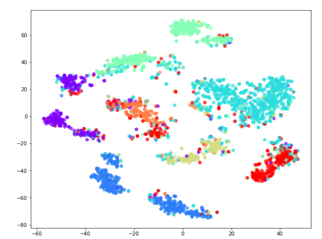

# Inductive Representation Learning on Large Graphs

### Breif Review

-   GCN에서 영감을 얻어 발전한 방법
    -   저자는 특별히 GCN의 transductive한 방식에서 inductive한 방식으로 발전시켰다고 함
-   3종류의 aggregator를 실험하였고 전반적인 성능은 유사함
    -   3종류의 aggregator는 Mean, LSTM, Pooling(mean, max)
    -   LSTM의 경우 random permutation에도 불구하고 좋은 성능을 보여줌
    -   시간을 고려하면 maxpooling 방식이 적합하다고 판단

#### Description from StellarGraph

```markdown
- Supports supervised as well as unsupervised representation learning, node classification/regression, and link prediction for homogeneous networks. The current implementation supports multiple aggregation methods, including mean, maxpool, meanpool, and attentional aggregators.
```

### Code Review

-   GraphSAGE는 다양한 방식으로 구현되어 있음
    -   aggregator로는 mean, pooling(max, mean), attention 등의 방식과 directed그래프 방식도 사용 가능

#### Node Classification

-   GCN과 마찬가지로  generator를 사용

```python
from stellargraph.mapper import GraphSAGENodeGenerator

generator = GraphSAGENodeGenerator(G, batch_size=32, num_samples=[10, 5]) # graph, bat_ㅜum, sample_sum

```

-   GCN과 비교하여 aggregator종류가 다양하여 여러 선택지가 가능

```python
from stellargraph.layer import GraphSAGE 
# MeanAggregator, MaxPoolingAggregator, MeanPoolingAggregator, AttentionalAggregator, DirectedGraphSAGE

graphsage = GraphSAGE([32, 32], activations=['relu', 'relu'], generator=generator, bias=True, dropout=0.3)
nc_inp, nc_out = graphsage.build()
```

-   NC에서의 성능은 GCN과 비교하여 드라마틱하게 향상되지는 않지만 임베딩결과에서 큰 차이를 보여줌
    -   directed버전은 다른 자료이기에 참고만

##### GraphSAGE


##### GraphSAGE-Directed


##### GCN


-   Directed방식에서는 4가지 타입이 존재
    -   in and out
    -   only in(out_agg=0)
    -   only out(in_agg=0)
    -   no in and out
-   위 방식에 따라 분류해서 살펴볼 수도 있음


#### Link Prediction

-   lp에서는 코드상의 차이는 generator를 다른 방법을 사용한다는 것 이외에는 큰 차이 없음

```python
from stellargraph.mapper import GraphSAGELinkGenerator

train_gen = GraphSAGELinkGenerator(G_train, 32, [32, 16])
train_flow = train_gen.flow(edge_ids_train, edge_labels_train, shuffle=True)

test_gen = GraphSAGELinkGenerator(G_test,  32, [32, 16])
test_flow = train_gen.flow(edge_ids_test, edge_labels_test)
```

-   GCN에서 LinkEmbedding방식과 reshape을 함께 사용했는데 한번에 구현한 함수가 존재
    -   source code를 살펴보니 동일하게 embedding과 reshape을 사용

```python
from stellargraph.layer import link_classification

lp_layer = link_classification(output_dim=1, output_act="sigmoid", edge_embedding_method="ip")(lp_out)

lp_model = Model(lp_inp, lp_layer)
```

